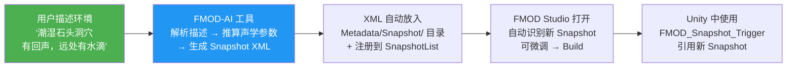
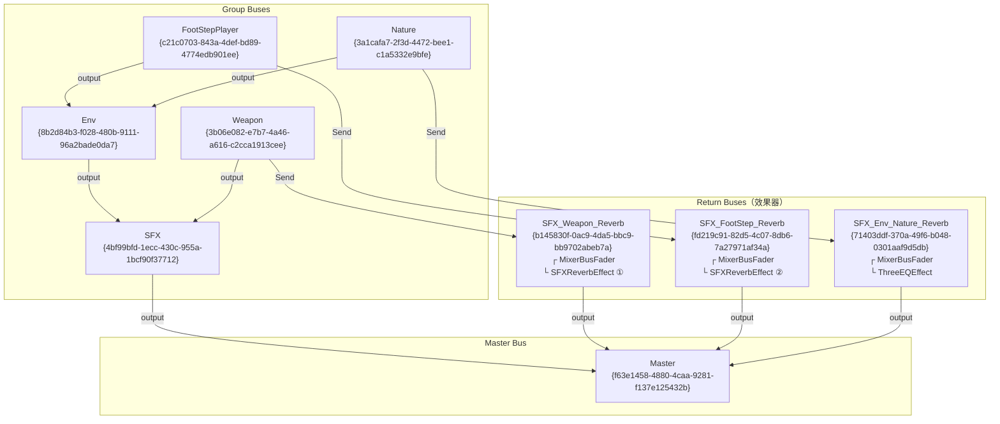
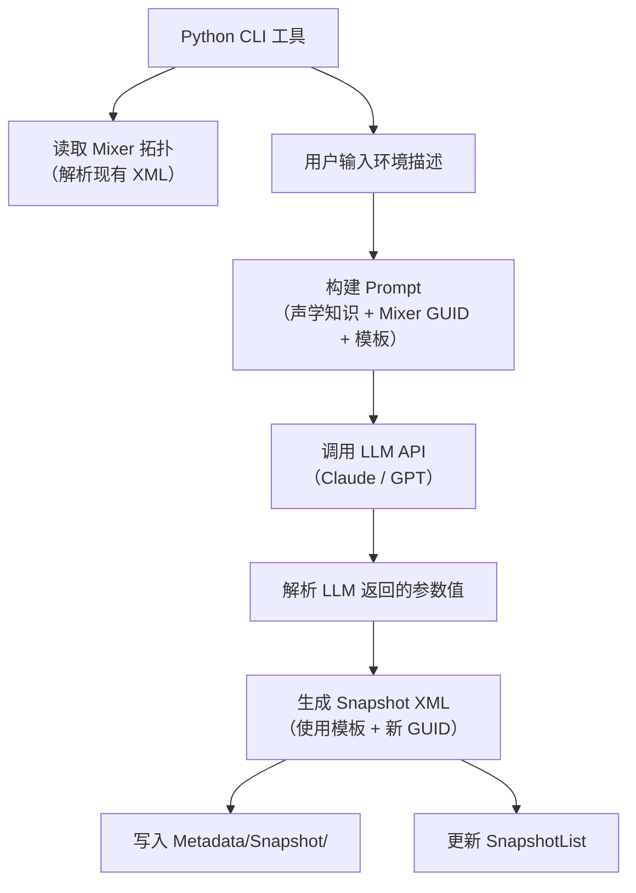

# 工具：FMOD-AI Snapshot 生成器

> 最后更新：2026-04-16
> 状态：**概念验证已通过**（已成功手动生成 `Reverb_Cave_Deep` Snapshot XML）
> 优先级：🟠 工具链优化（不阻塞主线开发，但能显著提升场景音效迭代效率）

---

## 一、问题背景

### 当前痛点

为每个场景区域创建 FMOD Snapshot 的工作流非常繁琐：

```
打开 FMOD Studio → 手动创建 Snapshot → 逐个调节 37+ 个参数
→ 构建 Bank → 回到 Unity 放触发器 → 填写 snapshotName
```

每新增一个场景类型（室内、洞穴、走廊、室外开阔地……）都要重复这个过程。
对于非专业调音师来说，调节 Reverb 的 13 个参数 × 2 组 + EQ + 各 Bus 音量 = **37 个参数**，
既不直观，也很难保证声学合理性。

### 关键发现

FMOD Studio 的所有项目元数据以 **纯文本 XML** 格式存储：

```
FMOD projects/ProjectII/Metadata/
├── Snapshot/          ← Snapshot 定义 + 参数覆盖（纯 XML）
├── Event/             ← 事件定义
├── Group/             ← Mixer Bus 定义
├── Return/            ← Return Bus + 效果器定义
├── AudioFile/         ← 音频文件引用
├── SnapshotGroup/     ← Snapshot 列表注册
├── Mixer.xml          ← 全局 Mixer 对象
└── ...
```

只有最终构建的 `.bank` 文件是二进制的，源文件全是文本。
这意味着 **LLM 可以直接生成 Snapshot XML 文件**，完全不需要打开 FMOD Studio 手动调参。

---

## 二、目标工作流



**核心原则：完全不破坏现有管线**
- 不需要改任何 Unity 代码
- 不需要改 `FMOD_Snapshot_Trigger` 的逻辑
- 生成的 Snapshot 和手动创建的完全一样
- FMOD Studio 打开后能正常编辑、微调

---

## 三、技术基础：Mixer 拓扑结构

### 3.1 当前 Mixer 拓扑图



### 3.2 Snapshot 可控制的对象 GUID 映射表

这是生成 Snapshot XML 的核心参考表。**如果 Mixer 拓扑发生变化（新增/删除 Bus 或效果器），此表必须同步更新。**

| 对象类型 | 名称 | GUID | 可控属性 |
|----------|------|------|----------|
| **SFXReverbEffect ①** | 挂在 SFX_Weapon_Reverb 上 | `{70b3adad-fc9e-4505-9ac8-f70a03d99c27}` | decayTime, earlyDelay, lateDelay, HFDecayRatio, HFReference, diffusion, density, wetLevel, dryLevel, lowShelfGain, highCut, lowShelfFrequency, earlyLateMix |
| **SFXReverbEffect ②** | 挂在 SFX_FootStep_Reverb 上 | `{8f0fb7d5-e70c-4d3a-9482-d0e808c9ca9b}` | 同上 13 个参数 |
| **ThreeEQEffect** | 挂在 SFX_Env_Nature_Reverb 上 | `{ba2836fc-6620-4ca9-b32c-913878755e70}` | lowGain, midGain, highGain |
| **MixerReturn** | SFX_Weapon_Reverb | `{b145830f-0ac9-4da5-bbc9-bb9702abeb7a}` | volume |
| **MixerReturn** | SFX_Env_Nature_Reverb | `{71403ddf-370a-49f6-b048-0301aaf9d5db}` | volume |
| **MixerReturn** | SFX_FootStep_Reverb | `{fd219c91-82d5-4c07-8db6-7a27971af34a}` | volume |
| **MixerGroup** | Env | `{8b2d84b3-f028-480b-9111-96a2bade0da7}` | volume |
| **MixerGroup** | FootStepPlayer | `{c21c0703-843a-4def-bd89-4774edb901ee}` | volume |
| **MixerSend** | Weapon → SFX_Weapon_Reverb | `{36d59cda-0ad2-4ec4-a68a-e38a4d15bb53}` | level |
| **MixerSend** | Nature → SFX_Env_Nature_Reverb | `{51d812f6-f4fe-472d-b13a-17d00909fb6f}` | level |
| **MixerSend** | FootStep → SFX_FootStep_Reverb | `{b83ab3b7-9ea3-431b-94a4-d0d5b580ebd5}` | level |

### 3.3 全局固定 GUID

| 对象 | GUID | 说明 |
|------|------|------|
| Mixer | `{6fe86360-dab7-464e-926e-4478029c0178}` | 每个 Snapshot 的 `mixer` 关系必须指向此对象 |
| SnapshotList | `{005f62c4-bbeb-4f28-8a0e-cd87f623abbe}` | 新 Snapshot 必须注册到此列表的 `items` 中 |
| MixerGroup: SFX | `{4bf99bfd-1ecc-430c-955a-1bcf90f37712}` | SnapshotTrack 需要引用 |

---

## 四、Snapshot XML 结构规范

### 4.1 文件结构

每个 Snapshot 是一个独立的 XML 文件，存放在 `Metadata/Snapshot/` 目录下，文件名为 `{GUID}.xml`。

```xml
<?xml version="1.0" encoding="UTF-8"?>
<objects serializationModel="Studio.02.03.00">
    <!-- 1. Snapshot 主对象 -->
    <object class="Snapshot" id="{新GUID}">
        <property name="name"><value>Snapshot名称</value></property>
        <relationship name="mixer">
            <destination>{6fe86360-dab7-464e-926e-4478029c0178}</destination>
        </relationship>
        <relationship name="automatableProperties">
            <destination>{新GUID-A}</destination>
        </relationship>
        <relationship name="markerTracks">
            <destination>{新GUID-B}</destination>
        </relationship>
        <relationship name="timeline">
            <destination>{新GUID-C}</destination>
        </relationship>
        <relationship name="snapshotMasterTrack">
            <destination>{新GUID-D}</destination>
        </relationship>
        <relationship name="snapshotProperties">
            <!-- 每个被覆盖的参数一个 destination -->
            <destination>{新GUID-P1}</destination>
            <destination>{新GUID-P2}</destination>
            ...
        </relationship>
        <relationship name="snapshotTracks">
            <!-- 每个被覆盖的 MixerStrip 一个 destination -->
            <destination>{新GUID-T1}</destination>
            ...
        </relationship>
    </object>

    <!-- 2. 固定辅助对象（每个 Snapshot 都需要，内容为空） -->
    <object class="EventAutomatableProperties" id="{新GUID-A}" />
    <object class="MarkerTrack" id="{新GUID-B}" />
    <object class="Timeline" id="{新GUID-C}" />
    <object class="SnapshotMasterTrack" id="{新GUID-D}" />

    <!-- 3. SnapshotProperty 对象（每个被覆盖的参数一个） -->
    <object class="SnapshotProperty" id="{新GUID-P1}">
        <property name="propertyName"><value>参数名</value></property>
        <property name="value"><value>参数值</value></property>
        <relationship name="automatableObject">
            <destination>{目标效果器/Bus的固定GUID}</destination>
        </relationship>
    </object>
    ...

    <!-- 4. SnapshotTrack 对象（每个被覆盖的 MixerStrip 一个） -->
    <object class="SnapshotTrack" id="{新GUID-T1}">
        <relationship name="mixerStrip">
            <destination>{目标MixerStrip的固定GUID}</destination>
        </relationship>
    </object>
    ...
</objects>
```

### 4.2 注册到 SnapshotList

新 Snapshot 创建后，必须在 `Metadata/SnapshotGroup/{005f62c4-bbeb-4f28-8a0e-cd87f623abbe}.xml` 的 `items` 关系中添加一行：

```xml
<destination>{新Snapshot的GUID}</destination>
```

### 4.3 GUID 生成规则

- FMOD Studio 使用标准 UUID v4 格式：`{xxxxxxxx-xxxx-xxxx-xxxx-xxxxxxxxxxxx}`
- 每个 Snapshot 文件内需要生成的新 GUID 数量：
  - 1 个 Snapshot 主对象
  - 4 个辅助对象（EventAutomatableProperties, MarkerTrack, Timeline, SnapshotMasterTrack）
  - 37 个 SnapshotProperty（如果覆盖全部参数）
  - 8 个 SnapshotTrack
  - **合计约 50 个新 GUID**
- 所有引用已有 Mixer 对象的 GUID 保持不变（见 3.2 映射表）

---

## 五、SFXReverbEffect 参数声学参考

这是 LLM 生成参数值时的声学知识库。

### 5.1 参数说明

| 参数 | 单位 | 范围 | 说明 |
|------|------|------|------|
| decayTime | ms | 100~20000 | 混响衰减时间。小房间 200~500，大厅 1000~3000，洞穴 3000~8000 |
| earlyDelay | ms | 0~300 | 早期反射延迟。空间越大越长。小房间 1~5，大空间 15~30 |
| lateDelay | ms | 0~100 | 晚期反射延迟。通常为 earlyDelay 的 1.5~2 倍 |
| HFDecayRatio | % | 10~100 | 高频衰减比。石头/瓷砖 30~50（反射强），布料/木头 60~80（吸收少） |
| HFReference | Hz | 1000~20000 | 高频参考频率。通常 3000~5000 |
| diffusion | % | 0~100 | 扩散度。光滑墙面 20~40，粗糙/不规则表面 60~90 |
| density | % | 0~100 | 反射密度。开阔空间 20~40，密闭空间 70~95 |
| wetLevel | dB | -80~20 | 湿信号（混响）电平。越高混响越明显 |
| dryLevel | dB | -80~20 | 干信号（直达声）电平。-80 表示完全没有直达声 |
| lowShelfGain | dB | -36~12 | 低频增益。正值增强低频隆隆声 |
| highCut | Hz | 20~20000 | 高频截止。石头/混凝土 2000~4000，开阔空间 8000~15000 |
| lowShelfFrequency | Hz | 20~1000 | 低频架式滤波器频率。通常 150~300 |
| earlyLateMix | % | 0~100 | 早期/晚期反射混合比。50 为均衡 |

### 5.2 典型环境预设参考值

#### 室内小房间（Indoor Small）

```
decayTime: 400        earlyDelay: 5         lateDelay: 10
HFDecayRatio: 40      HFReference: 5000     diffusion: 40
density: 33           wetLevel: 0           dryLevel: -80
lowShelfGain: -8      highCut: 5000         lowShelfFrequency: 250
earlyLateMix: 50
```

#### 深邃石头洞穴（Cave Deep）

```
decayTime: 3500~4500  earlyDelay: 18~22     lateDelay: 30~35
HFDecayRatio: 28~35   HFReference: 3000~3500 diffusion: 75~85
density: 85~95        wetLevel: -4~-2       dryLevel: -6~-3
lowShelfGain: -3~-2   highCut: 2500~3500    lowShelfFrequency: 200
earlyLateMix: 40~50
```

#### 室外开阔地（Outdoor Open）

```
decayTime: 100~300    earlyDelay: 1~3       lateDelay: 3~8
HFDecayRatio: 70~85   HFReference: 8000     diffusion: 15~25
density: 10~20        wetLevel: -20~-15     dryLevel: 0
lowShelfGain: -2      highCut: 12000~15000  lowShelfFrequency: 150
earlyLateMix: 60~70
```

#### 走廊 / 通道（Corridor）

```
decayTime: 800~1500   earlyDelay: 3~8       lateDelay: 8~15
HFDecayRatio: 45~55   HFReference: 4500     diffusion: 50~65
density: 55~70        wetLevel: -5~-2       dryLevel: -10~-5
lowShelfGain: -5      highCut: 4000~6000    lowShelfFrequency: 200
earlyLateMix: 45~55
```

#### 大厅 / 教堂（Large Hall）

```
decayTime: 2000~4000  earlyDelay: 12~20     lateDelay: 20~30
HFDecayRatio: 50~65   HFReference: 5000     diffusion: 60~75
density: 60~80        wetLevel: -3~0        dryLevel: -5~-2
lowShelfGain: -4      highCut: 5000~8000    lowShelfFrequency: 250
earlyLateMix: 50
```

#### 浴室 / 瓷砖房间（Bathroom / Tiled Room）

```
decayTime: 1200~2000  earlyDelay: 2~5       lateDelay: 5~10
HFDecayRatio: 55~70   HFReference: 6000     diffusion: 30~45
density: 70~85        wetLevel: -2~0        dryLevel: -8~-4
lowShelfGain: -6      highCut: 6000~8000    lowShelfFrequency: 200
earlyLateMix: 50~60
```

---

## 六、实现方案

### 方案 A：LLM 对话式生成（当前可用）

**工具**：直接在 AI 对话中描述环境，AI 生成 XML 文件。

**工作流**：
1. 在对话中描述场景："帮我生成一个 FMOD Snapshot，场景是潮湿的石头洞穴，有回声"
2. AI 根据声学知识推算参数值
3. AI 生成完整的 Snapshot XML 文件并写入 `Metadata/Snapshot/` 目录
4. AI 更新 SnapshotList 注册
5. 用户打开 FMOD Studio → Build → 在 Unity 中使用

**优点**：零开发成本，现在就能用
**缺点**：每次需要打开对话，不够自动化

**状态**：✅ 已验证可行（`Reverb_Cave_Deep` 已成功生成）

### 方案 B：Python 命令行工具（推荐下一步）

**工具**：一个 Python 脚本，输入环境描述，自动调用 LLM API 生成 XML。

**架构**：



**文件结构**：

```
Tools/
└── fmod_ai_snapshot/
    ├── main.py                  # 入口脚本
    ├── config.py                # 配置（FMOD 项目路径、API Key）
    ├── mixer_parser.py          # 解析 Mixer 拓扑 XML → GUID 映射表
    ├── prompt_builder.py        # 构建 LLM Prompt（声学知识 + 模板）
    ├── llm_client.py            # LLM API 调用封装
    ├── snapshot_generator.py    # 根据参数值生成 Snapshot XML
    ├── snapshot_registrar.py    # 更新 SnapshotList
    ├── acoustic_presets.json    # 内置声学预设参考值
    └── requirements.txt         # 依赖：openai / anthropic, lxml
```

**核心模块说明**：

#### `mixer_parser.py` — Mixer 拓扑解析器

```python
# 自动扫描 Metadata/ 目录，构建 GUID 映射表
# 输入：FMOD 项目 Metadata 路径
# 输出：{
#   "reverb_effects": [{"name": "SFX_Weapon_Reverb", "guid": "...", "params": [...]}],
#   "eq_effects": [...],
#   "groups": [...],
#   "returns": [...],
#   "sends": [...]
# }
```

这个模块的价值在于：**当你在 FMOD Studio 中修改了 Mixer 拓扑（新增 Bus、新增效果器），工具能自动适应**，不需要手动更新 GUID 映射表。

#### `prompt_builder.py` — Prompt 构建器

```python
# 将声学知识、Mixer 拓扑、用户描述组合成 LLM Prompt
# Prompt 结构：
# 1. 系统角色：你是一个游戏音频设计师
# 2. 声学知识：各参数的含义和典型范围
# 3. Mixer 拓扑：当前项目的 Bus 结构和效果器
# 4. 参考预设：已有的 Snapshot 参数值
# 5. 用户描述：场景环境描述
# 6. 输出格式：JSON（参数名 → 值的映射）
```

#### `snapshot_generator.py` — XML 生成器

```python
# 输入：Snapshot 名称 + 参数值字典 + Mixer GUID 映射
# 输出：完整的 Snapshot XML 字符串
# 关键：
# - 为每个对象生成新的 UUID v4
# - 按照 FMOD 的 XML 格式严格生成
# - SnapshotProperty 引用正确的 automatableObject GUID
# - SnapshotTrack 引用正确的 mixerStrip GUID
```

**使用方式**：

```bash
# 基本用法
python main.py --describe "潮湿的石头洞穴，有回声，远处有水滴声" --name "Reverb_Cave_Wet"

# 基于已有预设微调
python main.py --preset cave --tweak "混响更长一些，高频再暗一点" --name "Reverb_Cave_Dark"

# 批量生成
python main.py --batch presets.json
```

### 方案 C：Unity Editor 工具（终极形态）

**工具**：Unity Editor 窗口，内置文本框输入描述，一键生成 + Build。

**架构**：

```
Unity Editor Window
├── 文本输入框（环境描述）
├── 预设下拉菜单（室内/室外/洞穴/走廊...）
├── 参数预览面板（生成后显示所有参数值）
├── 微调滑块（可手动调整 AI 生成的参数）
├── [生成 Snapshot] 按钮
│   ├── 调用 LLM API（或本地模型）
│   ├── 生成 XML → 写入 FMOD 项目
│   └── 更新 SnapshotList
├── [在 FMOD Studio 中打开] 按钮
└── [Build Banks] 按钮（调用 FMOD CLI 构建）
```

**优点**：完全集成在 Unity 工作流中，所见即所得
**缺点**：开发成本最高，需要处理 Editor UI、API 调用、FMOD CLI 集成

---

## 七、开发路线图

```
当前位置：
  ✅ 概念验证 → ⬅️【你在这里】→ Phase 1 → Phase 2 → Phase 3
```

### Phase 0：概念验证 ✅ 已完成

- [x] 分析 FMOD 项目 XML 结构
- [x] 完整映射 Mixer 拓扑 GUID
- [x] 手动生成 `Reverb_Cave_Deep` Snapshot XML
- [x] 注册到 SnapshotList
- [ ] **待验证**：在 FMOD Studio 中打开项目，确认新 Snapshot 被正确识别

### Phase 1：Python 命令行工具（预计 2~3 天）

**目标**：能通过命令行输入描述，自动生成可用的 Snapshot XML。

| 任务 | 优先级 | 预计耗时 |
|------|--------|----------|
| `mixer_parser.py`：自动解析 Mixer 拓扑 | P0 | 0.5 天 |
| `snapshot_generator.py`：XML 模板生成 | P0 | 0.5 天 |
| `snapshot_registrar.py`：更新 SnapshotList | P0 | 0.5 小时 |
| `prompt_builder.py`：构建 LLM Prompt | P0 | 0.5 天 |
| `llm_client.py`：API 调用封装 | P0 | 0.5 天 |
| `main.py`：CLI 入口 + 参数解析 | P1 | 0.5 天 |
| 内置声学预设 JSON | P1 | 0.5 天 |
| 测试：生成 3~5 个不同环境的 Snapshot 并在 FMOD Studio 中验证 | P0 | 0.5 天 |

### Phase 2：增强功能（预计 1~2 天）

| 任务 | 说明 |
|------|------|
| 批量生成模式 | 从 JSON 文件读取多个环境描述，一次性生成 |
| 预设微调模式 | 基于已有预设，用自然语言描述调整方向 |
| 参数验证 | 检查生成的参数值是否在合理范围内 |
| 差异对比 | 显示新 Snapshot 与已有 Snapshot 的参数差异 |
| Mixer 拓扑变更检测 | 检测 FMOD 项目 Mixer 是否发生变化，自动更新映射 |

### Phase 3：Unity Editor 集成（预计 3~5 天）

| 任务 | 说明 |
|------|------|
| Editor Window UI | 描述输入、预设选择、参数预览 |
| 参数微调滑块 | 可视化调整 AI 生成的参数 |
| FMOD CLI 集成 | 一键 Build Banks |
| 实时预览（可选） | 通过 FMOD Runtime API 实时预览混响效果 |

---

## 八、注意事项与风险

### 8.1 GUID 兼容性

- FMOD Studio 可能对 GUID 格式有特殊要求（必须是真正的随机 UUID v4）
- **验证方法**：生成一个 Snapshot 后在 FMOD Studio 中打开，确认无报错
- 如果有问题，改用 Python 的 `uuid.uuid4()` 生成真正的随机 UUID

### 8.2 Mixer 拓扑变更

- 如果在 FMOD Studio 中修改了 Mixer（新增/删除 Bus、效果器），GUID 映射表需要更新
- Phase 1 的 `mixer_parser.py` 会自动解析，但手动生成时需要注意
- **建议**：每次修改 Mixer 后，运行一次 `mixer_parser.py` 更新映射

### 8.3 serializationModel 版本

- 当前 FMOD 项目使用 `serializationModel="Studio.02.03.00"`
- 如果升级 FMOD Studio 版本，序列化格式可能变化
- **建议**：生成 XML 时从现有文件中读取 `serializationModel` 值，而非硬编码

### 8.4 LLM 参数准确性

- LLM 生成的声学参数是基于通用声学知识的**合理估计**，不是精确的物理模拟
- 生成的 Snapshot 应视为**起点**，在 FMOD Studio 中试听后微调
- 内置预设参考值可以提高准确性

### 8.5 并发编辑

- 如果 FMOD Studio 正在打开项目，同时修改 XML 文件可能导致冲突
- **建议**：生成 Snapshot 前关闭 FMOD Studio，生成后再打开

---

## 九、已生成的 Snapshot 记录

| Snapshot 名称 | GUID | 环境描述 | 生成日期 | 状态 |
|---------------|------|----------|----------|------|
| Reverb_Indoor_0 | `{2a3462cc-9230-4d79-abf4-5ff67ec8729b}` | 室内小房间（手动创建） | — | ✅ 已验证 |
| Reverb_Cave_Deep | `{a1b2c3d4-e5f6-7890-abcd-ef1234567890}` | 深邃潮湿石头洞穴 | 2026-04-16 | ⏳ 待验证 |

---

## 十、相关文件索引

| 文件 | 说明 |
|------|------|
| `FMOD projects/ProjectII/Metadata/Snapshot/` | Snapshot XML 存放目录 |
| `FMOD projects/ProjectII/Metadata/SnapshotGroup/{005f62c4-...}.xml` | Snapshot 注册列表 |
| `FMOD projects/ProjectII/Metadata/Mixer.xml` | 全局 Mixer 对象 |
| `FMOD projects/ProjectII/Metadata/Group/` | Mixer Group Bus 定义 |
| `FMOD projects/ProjectII/Metadata/Return/` | Return Bus + 效果器定义 |
| `Assets/FX/FMOD_Snapshot_Trigger.cs` | Unity 侧 Snapshot 触发器脚本 |
